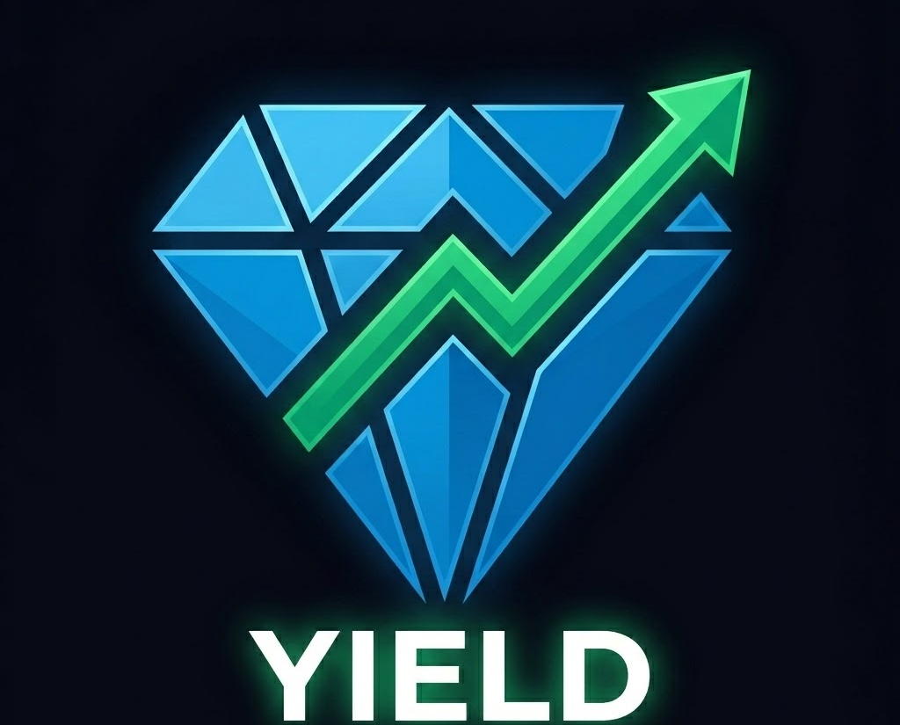

<div align="center">



# 💎 TonSense Yield

### Find where your crypto earns the most. Swap in one click.

[](https://tonsense-yield.vercel.app)
[](https://nextjs.org)
[](https://www.typescriptlang.org)
[](https://tailwindcss.com)
[](https://vercel.com)

[](https://ston.fi)
[](https://omniston.ston.fi)
[](https://docs.ton.org/develop/dapps/ton-connect/overview)

<br />

**TonSense Yield** is a cross-chain yield comparator that shows you where USDT, USDC, and TON earn the highest APY — across TON, Ethereum, Base, and BNB Chain — and lets you swap to the best rate in a single on-chain transaction via [Omniston](https://omniston.ston.fi).

[**🌐 Live App**](https://tonsense-yield.vercel.app) · [**📖 Docs**](#-architecture) · [**🛠 Local Setup**](#-getting-started) · [**🏆 Hackathon**](#-hackathon)

</div>

---

## ✨ Features

| Feature | Description |
|---|---|
| 📊 **Cross-chain APY Table** | Live comparison across TON · Ethereum · Base · BNB for USDT, USDC, and TON |
| ⚡ **Real Omniston RFQ** | WebSocket quote stream — live bids from resolvers, 15s timeout fallback |
| 🔄 **One-click Swap** | Verified on-chain: `2 USDT → 1.205 TON` · [tx `41890b88`](https://tonviewer.com/transaction/41890b88) |
| 💰 **Wallet Balance** | Auto-fetches jetton + native TON balance via TON API v2 |
| 📈 **Yearly Yield Estimate** | Type an amount → see `+$41/yr` green estimate in real time |
| 🛡️ **Security Audit** | Per-protocol risk scores (Low / Medium / High) with finding breakdown |
| 🤖 **Mira AI Chat** | TON DeFi assistant with topic guard — only answers DeFi questions |
| 🔐 **TON Connect 2.0** | Connect any TON wallet; disconnect, address display, balance refresh |
| 💎 **TON Staking** | TON → tsTON via Tonstakers (5.2% APY, no lockup, liquid) |
| 📱 **Responsive Design** | Full mobile layout with glassmorphism dark theme |

---

## 🎬 Demo

> **Verified on-chain swap** — 2 USDT on TON → 1.205 TON native via Omniston resolver network

```
Input:   2 USDT  (EQCxE6mU…)  on TON
Output:  1.205 TON (native)
Tx hash: 41890b88…
Route:   Omniston RFQ → STON.fi resolver → intrachain SWAP settlement
```

The full flow:
1. User types amount → RFQ opens WebSocket to Omniston
2. Resolver bids arrive as protobuf events → best quote displayed
3. User clicks **Swap** → `tonBuildSwap` constructs the BoC
4. TON Connect signs → transaction broadcast on-chain

---

## 🏗 Architecture

```
┌─────────────────────────────────────────────────────────────┐
│                     TonSense Yield                          │
│                                                             │
│  ┌──────────────┐   ┌──────────────┐   ┌────────────────┐  │
│  │  YieldTable  │   │  SwapModal   │   │  StakingModal  │  │
│  │              │   │              │   │                │  │
│  │  APY data    │   │  useRfq()    │   │  Tonstakers    │  │
│  │  per chain   │   │  WebSocket   │   │  external link │  │
│  │  + estimates │   │  quote stream│   │                │  │
│  └──────┬───────┘   └──────┬───────┘   └────────────────┘  │
│         │                  │                                 │
│         └──────────────────▼                                 │
│                   ┌────────────────┐                         │
│                   │ OmnistonProvider│                        │
│                   │ TonConnectUIProvider                     │
│                   │ ReactQueryProvider                       │
│                   └────────┬───────┘                         │
│                            │                                 │
│              ┌─────────────▼──────────────┐                  │
│              │     Omniston Resolvers      │                 │
│              │   (WebSocket RFQ stream)    │                 │
│              └────────────────────────────┘                  │
└─────────────────────────────────────────────────────────────┘
```

### Settlement modes

| Pair | Mode | Description |
|------|------|-------------|
| USDT on TON → TON | `SWAP` | Intrachain — STON.fi AMM, instant |
| USDC on TON → USDC on Base | `ORDER` | Cross-chain HTLC escrow |
| TON → tsTON | Staking | Tonstakers liquid staking (no Omniston) |

---

## 🧠 Key Technical Wins

### 1️⃣ Omniston protobuf `$case` parsing bug fix

The Omniston SDK emits `QuoteEvent["event"]` directly — the **inner** discriminated union — not the outer `QuoteEvent` wrapper. This means the `$case` field is at the **top level** of the emitted object, not nested under `.event`.

```typescript
// ❌ Wrong — always returns null
const eventCase = data["event"]["$case"];

// ✅ Fixed — reads $case at top level
function extractQuoteEvent(raw: unknown): SafeQuoteEvent | null {
  const data = raw as Record<string, unknown>;
  const eventCase = data["$case"];          // top-level discriminant
  if (eventCase === "quoteUpdated") {
    const quote = data["value"] as Quote;
    return { eventCase, quote };
  }
  return { eventCase };
}
```

### 2️⃣ hex → base64 BoC serialization

TON Connect expects base64-encoded Bag of Cells. The Omniston SDK returns hex payloads.

```typescript
function hexToBase64(hex: string): string {
  const bytes = new Uint8Array(
    hex.match(/.{1,2}/g)!.map((b) => parseInt(b, 16))
  );
  return btoa(String.fromCharCode(...bytes));
}

// In sendTransaction:
body: hexToBase64(msg.payload),  // always convert — never pass raw hex
```

### 3️⃣ All four address params for `tonBuildSwap`

The SDK requires `trader_dst_address` or it throws `"Invalid argument: trader_dst_address, expected not empty"`. All four address fields must be populated from the connected wallet.

```typescript
await omniston.tonBuildSwap({
  quoteId: qid,
  transferSrcAddress: toChainAddress("ton", userTonAddress),
  traderDstAddress:   toChainAddress("ton", userTonAddress),  // ← critical
  refundSrcAddress:   toChainAddress("ton", userTonAddress),
  gasExcessAddress:   toChainAddress("ton", userTonAddress),
  useRecommendedSlippage: true,
});
```

### 4️⃣ CSS stacking context trap — modal overlay fix

`position: relative` + `z-index` on a parent element creates a **stacking context** that traps `position: fixed` children inside it — they can no longer escape to the viewport root. Fixed by removing `z-index` from the page wrapper while keeping the header's own `z-index: 10`.

```tsx
// ❌ Traps fixed modal overlays inside the stacking context
<div className="relative min-h-screen z-10">

// ✅ No z-index on wrapper — fixed children escape to viewport root
<div className="relative min-h-screen">
```

---

## 🛠 Tech Stack

| Layer | Technology |
|---|---|
| **Framework** | Next.js 14 (App Router) |
| **Language** | TypeScript 5 |
| **Styling** | Tailwind CSS + custom CSS variables |
| **Blockchain SDK** | `@ston-fi/omniston-sdk-react` v1beta8 |
| **Wallet** | TON Connect 2.0 (`@tonconnect/ui-react`) |
| **AI Chat** | Mira AI API |
| **Balance API** | TON API v2 (`tonapi.io`) |
| **Deployment** | Vercel |

---

## 🚀 Getting Started

### Prerequisites

- Node.js ≥ 18
- A TON wallet (Tonkeeper, MyTonWallet, etc.)

### Install & run

```bash
git clone https://github.com/ArturPodchayev/tonsense-yield.git
cd tonsense-yield

npm install
npm run dev
```

Open [http://localhost:3000](http://localhost:3000).

### Environment variables

Create a `.env.local`:

```env
NEXT_PUBLIC_TON_CONNECT_MANIFEST_URL=https://your-domain.com/tonconnect-manifest.json
NEXT_PUBLIC_MIRA_API_KEY=your_mira_api_key
```

### Build for production

```bash
npm run build
npm start
```

---

## 📁 Project Structure

```
tonsense-yield/
├── app/
│   ├── layout.tsx          # Root layout — providers, global font
│   ├── page.tsx            # Home page — hero, stats, yield table
│   └── globals.css         # Dark theme, glassmorphism, CSS vars
├── components/
│   ├── Header.tsx          # Nav — Swap scroll anchor, AI Chat open
│   ├── YieldTable.tsx      # APY comparison table (desktop + mobile)
│   ├── SwapModal.tsx       # Omniston RFQ + swap execution modal
│   ├── StakingModal.tsx    # TON → tsTON staking info modal
│   ├── SecurityModal.tsx   # Contract risk report modal
│   ├── StatsBar.tsx        # TVL / chains / protocols stat strip
│   └── MiraChat.tsx        # AI DeFi assistant sidebar
├── lib/
│   └── apyData.ts          # APY data, swap configs, security info
└── public/
    └── tonconnect-manifest.json
```

---

## 🛡️ Security Audit Feature

Each protocol in the yield table includes a hardcoded security assessment (🛡️ badge on hover). Clicking it opens a risk report with:

- **Risk level** — Low / Medium / High with colour-coded glow
- **Audited by** — audit firm attribution
- **Contract address** — truncated, copyable
- **Finding breakdown** — severity-tagged list (Info → High)

| Protocol | Risk | Notes |
|----------|------|-------|
| Tonstakers (TON staking) | 🟢 Low | Audited, 2+ years live, open-source |
| STON.fi DEX (USDT swap) | 🟢 Low | Battle-tested AMM, intrachain only |
| Omniston (USDC crosschain) | 🟡 Medium | Cross-chain bridge adds complexity |

> Tonsec live API integration planned — currently static analysis for MVP.

---

## 🏆 Hackathon

Built for **[STON.fi Vibe Coding Hackathon — Wave 2](https://ston.fi)**.

Part of the **TonSense** ecosystem — a suite of DeFi tools for the TON blockchain.

**What makes this submission stand out:**
- ✅ Real Omniston RFQ integration (not mocked) with verified on-chain tx
- ✅ All four `tonBuildSwap` address fields correctly wired
- ✅ Protobuf event parsing bug found and fixed
- ✅ Full glassmorphism UI with mobile support
- ✅ Security audit layer + Mira AI chat as bonus features

---

## Built by

**Artur Podchaev** — developer
- 🌐 [arturpodchaev.uz](https://arturpodchaev.uz)
- 💼 [linkedin.com/in/arturpodchayev](https://linkedin.com/in/arturpodchayev)

**greejjddg09** — QA & testing · [GitHub](https://github.com/greejjddg09)

---

<div align="center">

Built with 💎 on TON · Powered by [Omniston](https://omniston.ston.fi) · Part of TonSense

</div>
